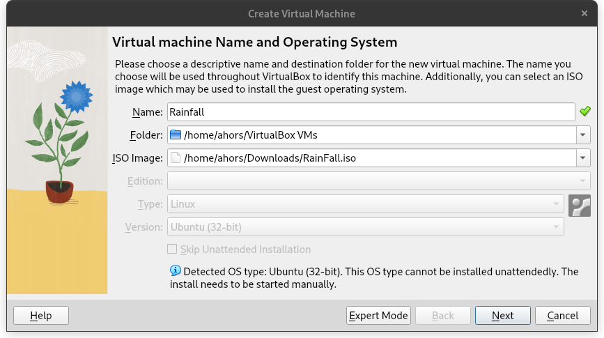
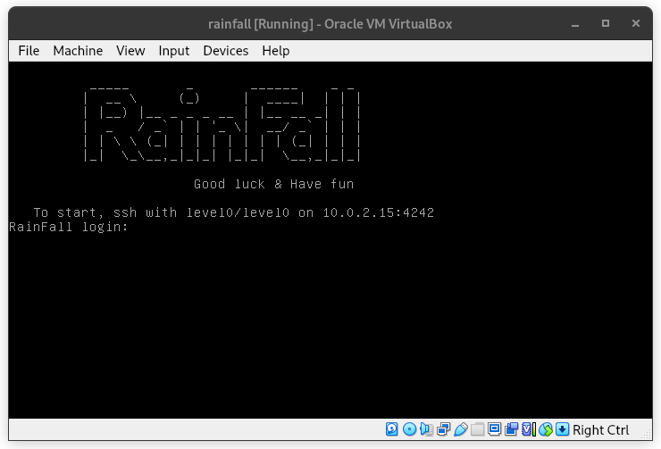

# 🌧️ Rainfall

## 📌 Description

**Rainfall** is an introductory project on exploiting ELF-like binaries.
This project focuses on understanding and exploiting simple vulnerabilities in Linux executables, through a progressive and educational approach.

## 🧰 Technologies used

- **C** – Main language used to compile vulnerable binaries.
- **Python** – Automation, exploitation, or analysis scripts.
- **GDB** – Debugger used for dynamic binary analysis.


## 🎯 Learning Objectives

- Learn how to analyze an ELF binary on Linux.
- Get started with exploiting vulnerabilities such as **buffer overflows**.
- Understand how the **stack**, **registers**, and protections like **ASLR** or **NX** work.
- Use tools such as **GDB**, or **Python scripts** for exploitation.

## 🧑‍💻 Prerequisites

- Basic knowledge of C language. 
- Linux environment (or VM).
- GDB
- VirtualBox installed

## 🚀 Quickstart


### Clone the repo

```bash
git clone https://github.com/ton-utilisateur/rainfall.git
cd rainfall
```
### Virtual Box

2. Create a VM with the Rainfall .iso file, keeping all default parameters.



Then launch the VM, if everything works you should see this:



### Connect to level0

Login: level0
Password: level0

To move on to the next level, you must read the .pass file of the upper level.
So for every level the final goal is to execute something like this:

```bash
$ cat /home/user/level1/.pass
```


## 👥 The Team 

<div style="display: flex; gap: 40px; justify-content: flex-start; align-items: center;">
  <a href="https://github.com/adrih1" style="text-align: center; text-decoration: none; color: inherit;">
    
  </a>
  <a href="https://github.com/Illouminus" style="text-align: center; text-decoration: none; color: inherit;">
    
  </a>
</div>
<br>

For each level, you will find the different steps we did in order to go onto the next level.


